# active-directory-home-lab
Virtualized Active Directory environment built with Windows Server 2019 and VirtualBox

# 🖥️ Active Directory Home Lab

A virtualized enterprise network built from scratch to simulate a real-world 
Active Directory environment. This project covers AD deployment, user management 
via PowerShell, Group Policy configuration, and Tier 1 help desk scenarios.

---

## 🛠️ Tools & Technologies

| Tool | Purpose |
|---|---|
| Oracle VirtualBox | Hypervisor for running virtual machines |
| Windows Server 2019 | Domain Controller |
| Windows 10 Pro | Domain-joined client machine |
| Active Directory Domain Services | Directory and identity management |
| Group Policy Management Console (GPMC) | GPO creation and management |
| PowerShell | Automated user provisioning |
| DNS & DHCP | Name resolution and IP assignment |

---

## 🌐 Network Diagram

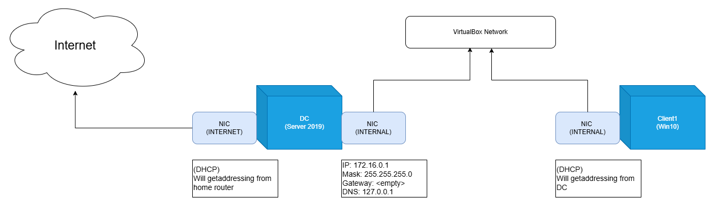

---

## 📁 Project Structure

### Organizational Units

Five OUs were created to mirror a real company structure:

| OU | Contents |
|---|---|
| _IT | 33 IT department users |
| _HR | 33 HR department users |
| _SALES | 33 Sales department users |
| _ADMINS | Administrative accounts |
| _COMPUTERS | Domain-joined client machines |

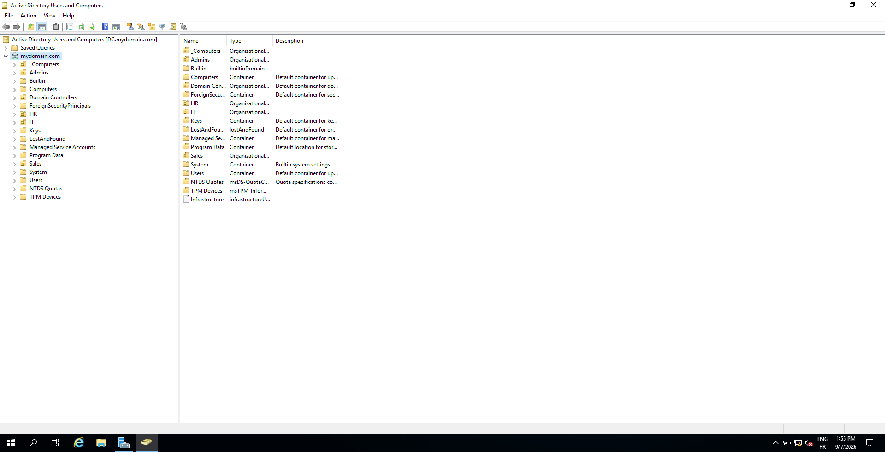

---

## ⚙️ PowerShell User Provisioning

100 domain user accounts were created automatically using a PowerShell script.
The script reads from a names list and distributes users across the IT, HR, 
and Sales OUs with randomized first and last name combinations.

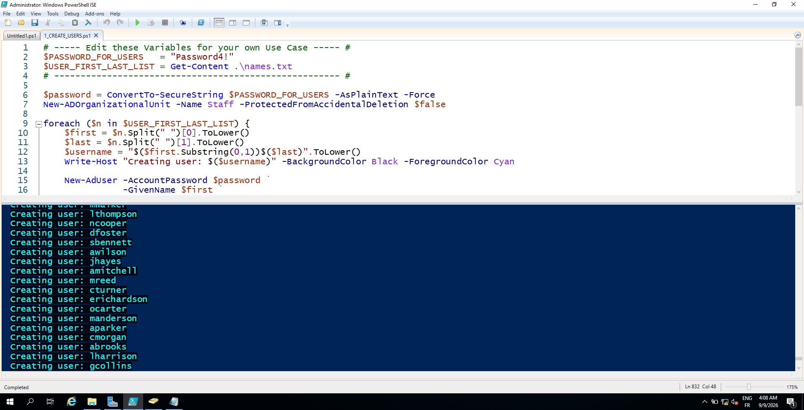

The full script is available here: [create-users.ps1](scripts/create-users.ps1)

---

## 👥 Users by Department

**IT Department**


**HR Department**

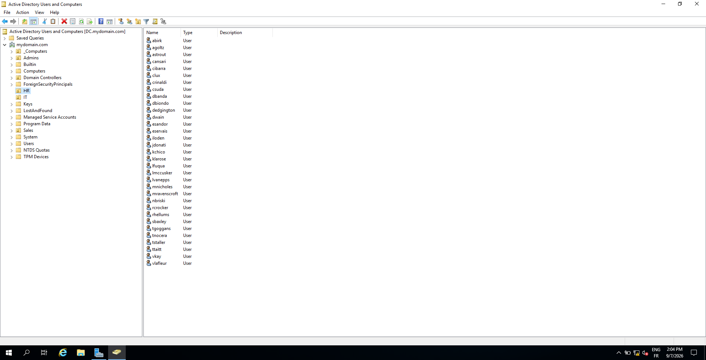

**Sales Department**

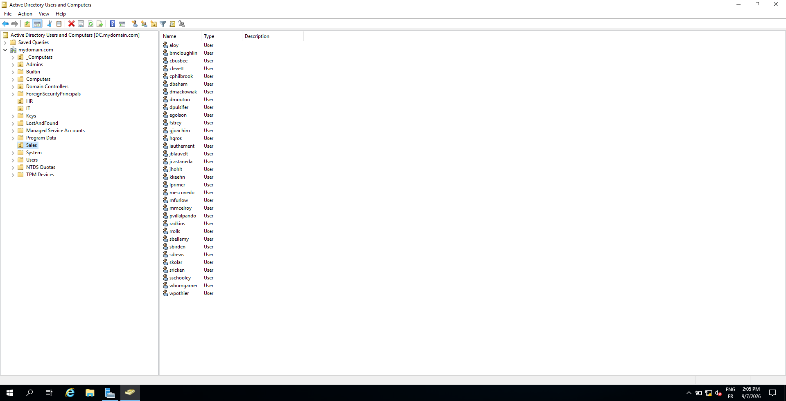

---

## 📋 Group Policy Objects

### GPO Overview

Four GPOs were created and linked across the domain and specific OUs.

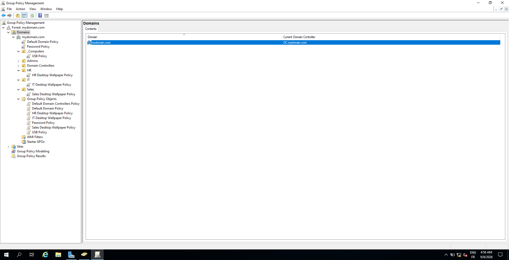

---

### 1️⃣ Password Policy — Domain Level

Linked at the domain level so it applies to all 100 users.

| Setting | Value |
|---|---|
| Minimum password length | 10 characters |
| Password complexity | Enabled |
| Maximum password age | 90 days |
| Minimum password age | 1 day |
| Password history | 10 passwords remembered |

**⚠️ Troubleshooting — GPO Precedence Conflict**

After creating the Password Policy GPO, short passwords were still being 
accepted. Investigation revealed that the Default Domain Policy (created 
automatically by Windows Server) had a lower minimum password length and 
was taking precedence over the new GPO.

**Fix:** Adjusted the GPO link order in GPMC so the custom Password Policy 
GPO sits above the Default Domain Policy, giving it higher precedence.

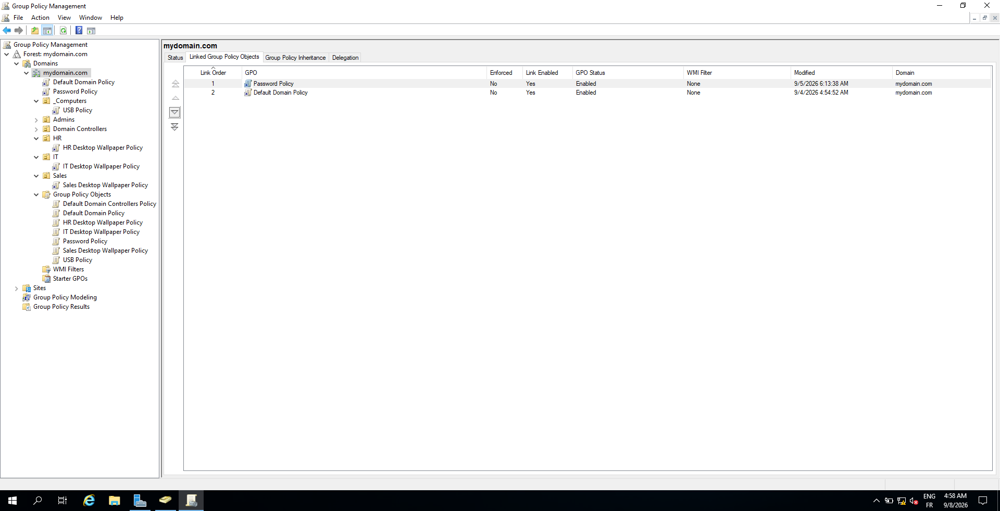

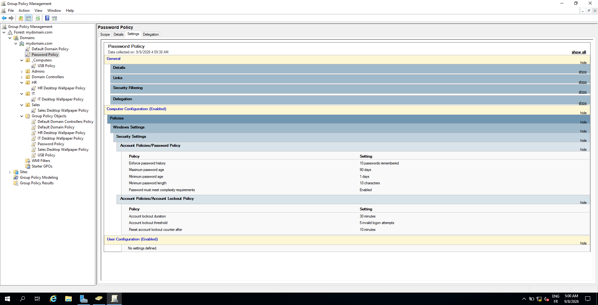

---

### 2️⃣ Account Lockout Policy — Domain Level

| Setting | Value |
|---|---|
| Lockout threshold | 5 invalid attempts |
| Lockout duration | 30 minutes |
| Reset counter after | 10 minutes |

**Scenario practiced:** Intentionally triggered a lockout by entering the 
wrong password 5 times, then unlocked the account from the DC via ADUC 
and verified the bad password count and last bad password timestamp in 
the user's Account properties.

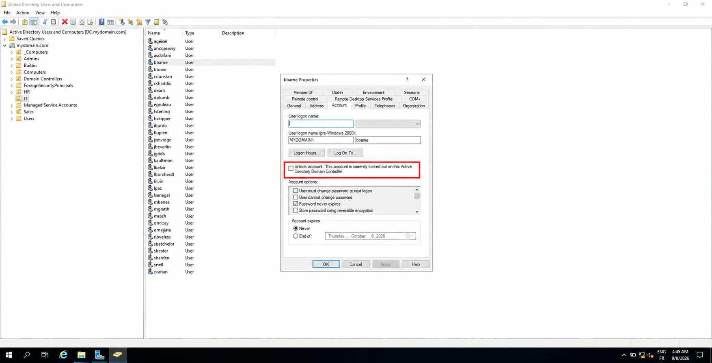

---

### 3️⃣ Department Wallpaper Policy — OU Level

A unique desktop wallpaper was enforced per department using three 
separate GPOs, each linked to their respective OU. Wallpaper images 
are hosted on a network share on the Domain Controller and pushed to 
clients via User Configuration. Users cannot manually change the wallpaper.

**IT Department**


**HR Department**


**Sales Department**


---

### 4️⃣ USB Storage Restriction — Computer Level

Linked to the `_COMPUTERS` OU. Blocks all removable storage access on 
domain-joined machines via Computer Configuration.

**Note:** The default `Computers` container in ADUC cannot have GPOs 
linked to it, a dedicated `_COMPUTERS` OU was created and the client 
machine was moved into it before the GPO could be applied.

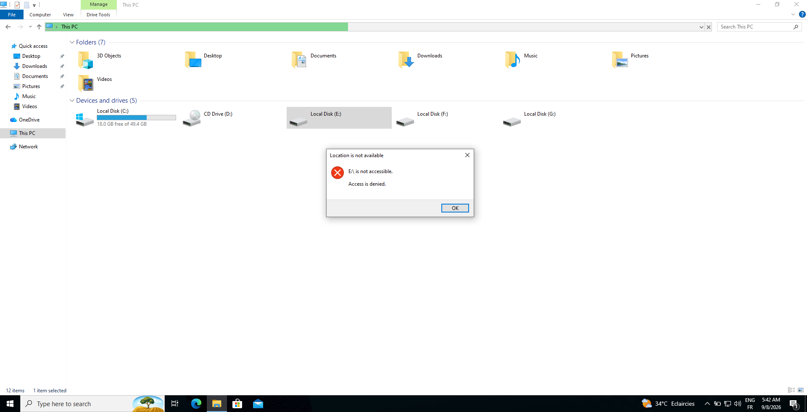

---

## ✅ GPO Verification

Used `gpresult /h` to generate a full HTML policy report on the client 
machine, confirming all GPOs are applied correctly.

```cmd
gpresult /h C:\gpresult.html /user:MYDOMAIN\username
```

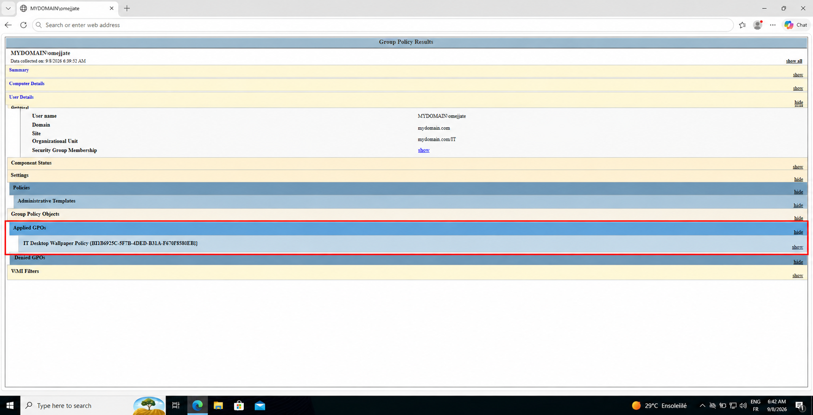
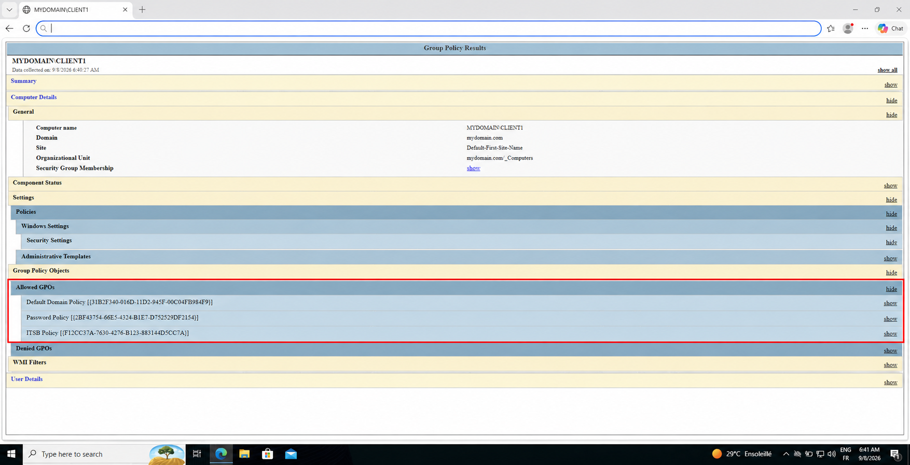

---

## 🎯 Help Desk Scenarios Practiced

- Unlocking a locked-out domain account via ADUC
- Resetting a domain user password
- Verifying bad password count and lockout timestamp in user properties
- Forcing Group Policy refresh with `gpupdate /force`
- Verifying applied policies with `gpresult /r` and `gpresult /h`
- Troubleshooting GPO precedence conflicts in GPMC

---

## 💡 Key Lessons Learned

- GPO precedence follows **LSDOU** order (Local → Site → Domain → OU). 
  A lower link order number means higher precedence, this caused a real 
  conflict that had to be diagnosed and fixed
- The default **Computers container** is not a true OU and cannot have 
  GPOs linked to it directly
- Password policies must be linked at the **domain level** to affect user 
  account passwords, OU-level password GPOs do not work for this
- The `redircmp` command redirects new computer objects to a custom OU 
  automatically instead of landing in the default Computers container
